# Electron-study

> Electron 快速学习，教程参考 [Electron开发仿网易云音乐播放器](https://coding.imooc.com/class/351.html)


## 开发环境

- Node / yarn
- Git

## Electron 相关资料

- [electron-github](https://github.com/electron/electron)
- [electron-官网](https://electronjs.org) 
- [elctron-官方文档](https://electronjs.org/docs)
- [Electron在Windows下的环境搭建](https://www.cnblogs.com/wangjian8888/p/7988439.html)

## 官网-demo

```bash
# 克隆示例项目的仓库
$ git clone https://github.com/electron/electron-quick-start

# 进入这个仓库
$ cd electron-quick-start

# 安装依赖并运行
$ npm install && npm start
```

通常，在执行 `npm install` 会 **很慢或者失败**，我们使用下面的方式：

```bash
# 安装 cnpm 同时切换到 淘宝源
npm install -g cnpm --registry=https://registry.npm.taobao.org

# 安装 electron
cnpm install -g electron

# 验证 electron 是否安装成功，这里如果是使用 windows powerShell会报错，用 cmd 可以
electron -v
```


为了方便最终成果输出，建议安装 electron-packager工具，安装也很简单，建议以下面的命令全局安装：

```bash
npm install -g electron-packager
```

以上，全部都成功以后，我们再执行如下命令

```bash
# 安装依赖并运行
$ npm install && npm start
```

此时，我们就可以看到 demo 已经跑起来啦


## 第一个 Electron 应用

### 主进程和渲染进程

> 这既是 Electron 最重要的渲染知识，也是 Chromium 的渲染知识

- 主进程和渲染进程
  - 主进程

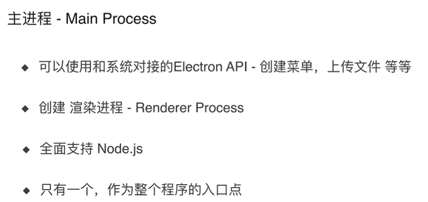

- 渲染进程

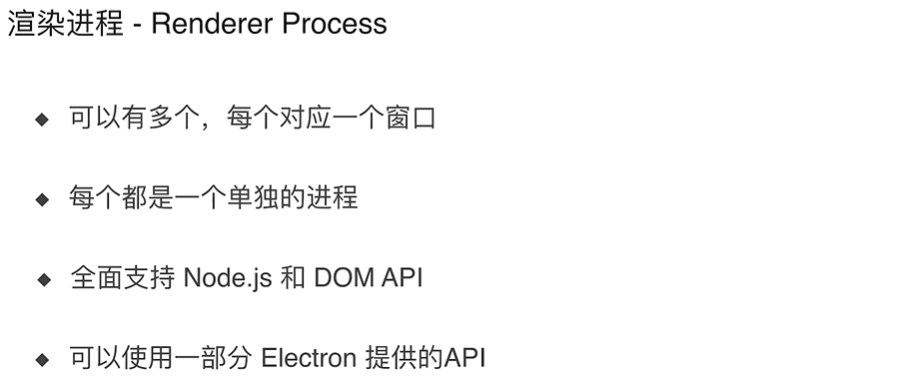


### 安装 nodemon 

> 安装 nodemon 来监听 main.js 的变化

执行如下命令：

```bash
npm install nodemon --save-dev
```

更改项目 `package.json` 

```js
"scripts": {
    "start": "nodemon --watch main.js --exec 'electron .'"
  },
```

### 重写 demo 代码

- 创建窗口

```js
const { app, BrowserWindow } = require('electron')

app.on('ready', () => {
  const mainWindow = new BrowserWindow({
    width: 800,
    height: 600,
    webPreferences: {
      nodeIntegration: true //设置这个可以使用 nodejs 的API
    }
  })

  mainWindow.loadFile("index.html")

})
```


- 创建子窗口

```js
const { app, BrowserWindow } = require('electron')

app.on('ready', () => {
  const mainWindow = new BrowserWindow({
    width: 800,
    height: 600,
    webPreferences: {
      nodeIntegration: true //设置这个可以使用 nodejs 的API
    }
  })

  mainWindow.loadFile("index.html")

  const secondWindow = new BrowserWindow({
    width: 600,
    height: 400,
    webPreferences: {
      nodeIntegration: true //设置这个可以使用 nodejs 的API
    },
    parent: mainWindow // 定义属性 父窗口，当父窗口关闭的时候，子窗口也会关闭
  })

  secondWindow.loadFile("second.html")
})

```

- 新建 `renderer.js` 文件，它既可以使用 nodejs 的 API，也可以使用 DOM 的 API

```js
alert(process.versions.node)

window.addEventListener("DOMContentLoaded", () => {
    alert("hello, dom")
})
```


## 进程通信

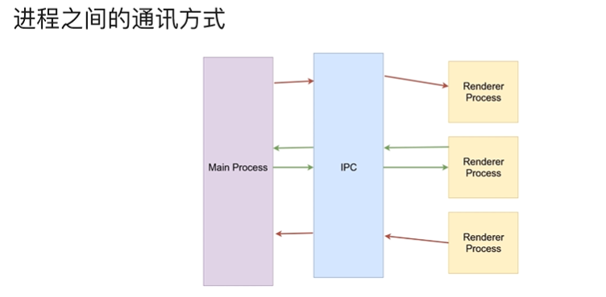

- ipcRenderer 和 ipcMain 的使用

- 发送信息

在 `renderer.js` 中 发送

```js
const { ipcRenderer } = requeire('electron')

window.addEventListener("DOMContentLoaded", () => {
    // 发送信息
    ipcRenderer.send("message", "hello, world~~")
})
```

在 `main.js` 中接受，并回复

```js
const { app, BrowserWindow, ipcMain } = require('electron')

app.on('ready', () => {
  const mainWindow = new BrowserWindow({
    width: 800,
    height: 600,
    webPreferences: {
      nodeIntegration: true //设置这个可以使用 nodejs 的API
    }
  })

  mainWindow.loadFile("index.html")

    // 这里 监听传送过来的信息
  ipcMain.on("message", (event, arg) => {
    console.log(arg)
    event.sender.send("reply", "I got your message")
  })

})

```

在 `renderer.js` 中接受到传来的信息

```js
const { ipcRenderer } = requeire('electron')

window.addEventListener("DOMContentLoaded", () => {
    ipcRenderer.send("message", "hello, world~~")
    // 接受并写入 dom
    ipcRenderer.on("reply", (event, arg) => {
        document.getElementById("reply").innerHTML = arg
    })
})
```


## 原型图分析

### 原型图

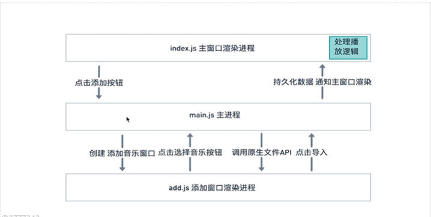

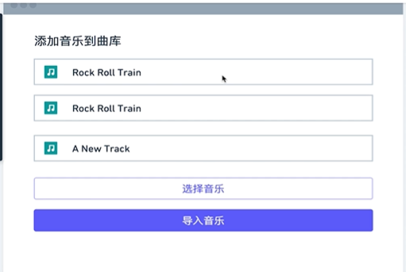

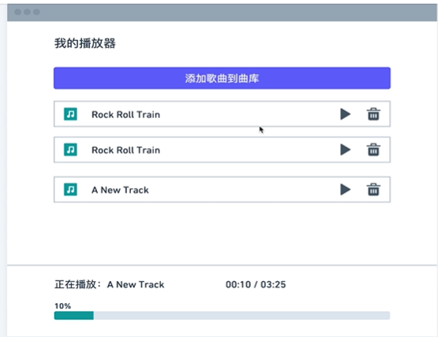

### 初始化项目结构

新建文件夹 renderer 和相关文件

```bash
renderer
├── add.html
├── add.js
├── index.html
└── index.js
```


## 播放器应用之添加音乐窗口

### 首页样式

- 安装 bootstrap: `npm install bootstrap --save`
- 引入 css

```html
<link rel="stylesheet" href="../node_modules/bootstrap/dist/css/bootstrap.min.css">
```

- 引入 [bootstrap](https://getbootstrap.com/docs/4.3/getting-started/introduction/) 相关组件：

```html
<!DOCTYPE html>
<html lang="en">
<head>
    <meta charset="UTF-8">
    <meta name="viewport" content="width=device-width, initial-scale=1.0">
    <meta http-equiv="X-UA-Compatible" content="ie=edge">
    <title>本地播放器</title>
    <link rel="stylesheet" href="../node_modules/bootstrap/dist/css/bootstrap.min.css">
</head>
<body>
    <div class="container">
        <h1>Hello, my player</h1>
        <button type="button" class="btn btn-primary btn-lg btn-block">添加到歌曲库</button>
    </div>
</body>
</html>
```

- 修改入口文件 main.js

```js
const { app, BrowserWindow, ipcMain } = require('electron')

app.on('ready', () => {
  const mainWindow = new BrowserWindow({
    width: 800,
    height: 600,
    webPreferences: {
      nodeIntegration: true //设置这个可以使用 nodejs 的API
    }
  })

  mainWindow.loadFile("./renderer/index.html") // 关键在这里

})


```

- 添加边距样式（学习下 bootstrap 的使用）

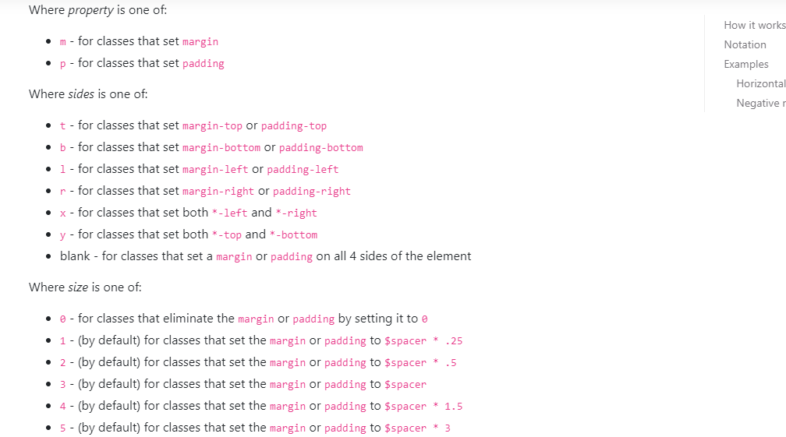

这里：

- `m` 表示 margin
- `p` 表示 padding
- 第二部分 `t,b,l,r,x,y` 分别表示 上、下、左、右、水平方向、竖直方向
- 第三部分 边距或者 padding 大小

代码：

```html
<body>
    <div class="container mt-4">
        <h1>Hello, my player</h1>
        <button type="button" class="btn btn-primary btn-lg btn-block mt-4">添加到歌曲库</button>
    </div>
</body>
```

测试主窗口和渲染窗口的通信：

编写 `index.html` 文件，引入 js

```html
<!DOCTYPE html>
<html lang="en">
<head>
    <meta charset="UTF-8">
    <meta name="viewport" content="width=device-width, initial-scale=1.0">
    <meta http-equiv="X-UA-Compatible" content="ie=edge">
    <title>本地播放器</title>
    <link rel="stylesheet" href="../node_modules/bootstrap/dist/css/bootstrap.min.css">
</head>
<body>
    <div class="container mt-4">
        <h1>Hello, my player</h1>
        <button type="button" id="add-music-button" class="btn btn-primary btn-lg btn-block mt-4">添加到歌曲库</button>
    </div>
    
    <script>
        // 这里使用 require 的方式引入，因为这里不仅可以使用 js 的方式，也可以使用 node 的方式
        require("./index.js")
    </script>
</body>
</html>
```


编写 `index.js` 文件

```js
const { ipcRenderer } = require("electron")

document.getElementById("add-music-button").addEventListener("click", () => {
    ipcRenderer.send('add-music-window', 'hello')
})
```

编写主程序 `main.js` 

```js
const { app, BrowserWindow, ipcMain } = require('electron')

app.on('ready', () => {
  const mainWindow = new BrowserWindow({
    width: 800,
    height: 600,
    webPreferences: {
      nodeIntegration: true //设置这个可以使用 nodejs 的API
    }
  })

  mainWindow.loadFile("./renderer/index.html")
  
  ipcMain.on('add-music-window', (event, args) => {
    console.log(args) // hello
  })
})
```


### 创建添加音乐窗口

编写 `add.html` 


编写 `add.js` 


编写 `main.js` 

```js
const { app, BrowserWindow, ipcMain } = require('electron')

app.on('ready', () => {
  const mainWindow = new BrowserWindow({
    width: 800,
    height: 600,
    webPreferences: {
      nodeIntegration: true //设置这个可以使用 nodejs 的API
    }
  })

  mainWindow.loadFile("./renderer/index.html")
  
  ipcMain.on('add-music-window', (event, args) => {
    const addWindow = new BrowserWindow({
      width: 500,
      height: 400,
      webPreferences: {
        nodeIntegration: true //设置这个可以使用 nodejs 的API
      },
      parent: mainWindow
    })
    addWindow.loadFile('./renderer/add.html')
  })

})

```


### 创建窗口类（代码优化）

编写 `main.js` 

```js
const { app, BrowserWindow, ipcMain } = require('electron')

class AppWindow extends BrowserWindow{
  constructor(config, fileLocation) {
    const basicConfig = {
      width: 800,
      height: 600,
      webPreferences: {
        nodeIntegration: true //设置这个可以使用 nodejs 的API
      }
    }

    const finalConfig = { ...basicConfig, ...config } // ES6语法，效果等同上面
    super(finalConfig)
    this.loadFile(fileLocation)
  }
}

app.on('ready', () => {
  const mainWindow = new AppWindow({}, './renderer/index.html') // 重构
  
  ipcMain.on('add-music-window', (event, args) => {
    const addWindow = new AppWindow({ // 重构
      width: 500,
      height: 400,
      webPreferences: {
        nodeIntegration: true //设置这个可以使用 nodejs 的API
      },
      parent: mainWindow
    }, './renderer/add.html')
  })

})


```

优雅地显示窗口：

- 文档：[优雅地显示窗口](https://electronjs.org/docs/api/browser-window)

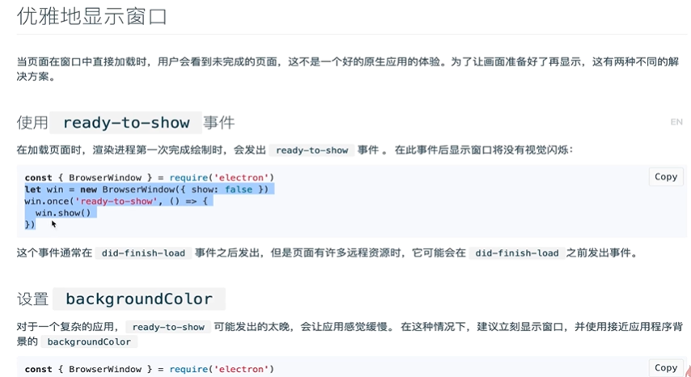

代码为：

```js
const { app, BrowserWindow, ipcMain } = require('electron')

class AppWindow extends BrowserWindow{
  constructor(config, fileLocation) {
    const basicConfig = {
      width: 800,
      height: 600,
      webPreferences: {
        nodeIntegration: true //设置这个可以使用 nodejs 的API
      }
    }

    //const finalConfig = Object.assign(basicConfig, config) // ES5写法 用后面的覆盖前面的
    const finalConfig = { ...basicConfig, ...config } // ES6语法，效果等同上面
    super(finalConfig)
    this.loadFile(fileLocation)
      // 优雅地显示窗口
    this.once('ready-to-show', () => {
      this.show()
    })
  }
}

//...

})

```

### 优雅地显示窗口

> 使用 dialog 可以帮助我们建立操作系统原生的对话框

- [dialog-文档](https://electronjs.org/docs/api/dialog)
- 简单封装工具函数 helper

```js
exports.$ = (id) => {
   return document.getElementById(id)
}
```

- `add.html` 中

```html
<!DOCTYPE html>
<html lang="en">
<head>
    <meta charset="UTF-8">
    <meta name="viewport" content="width=device-width, initial-scale=1.0">
    <meta http-equiv="X-UA-Compatible" content="ie=edge">
    <title>添加音乐</title>
    <link rel="stylesheet" href="../node_modules/bootstrap/dist/css/bootstrap.min.css">
</head>
<body>
    <div class="container mt-4">
        <h1>Hello, my player</h1>
        <button type="button" id="select-music" class="btn btn-outline-primary btn-lg btn-block mt-4">选择音乐</button>
    </div>
    <script>
        require("./add.js")
    </script>
</body>
</html>
```

- `add.js` 中

```js
const { $ } = require("./helper")
const { ipcRenderer } = require("electron")

$("select-music").addEventListener("click", () => {
    ipcRenderer.send('open-music-file')
})
```

- 代码：`main.js` 中

```js
const { app, BrowserWindow, ipcMain, dialog } = require('electron')

// ...省略部分代码  
ipcMain.on('open-music-file', () => {
    dialog.showOpenDialog({
      properties: ['openFile', 'multiSelections'], // 选择需要的功能
      filters: [
        { name: 'Music-Select', extensions: ['mp3'] }, // 过滤后看到的文件类型
      ]
    }, (files) => {
        console.log(files) // 打印出选中的 mp3 文件
    })
  })
```

### 展示添加的文件列表

几个知识点：

- 主程序给渲染进程发送事件
- 渲染进程监听事件作出相应
- node API 中 `path.basename(xxx)` 的使用
- `reduce`  的使用
- [BootStrap-List](https://getbootstrap.com/docs/4.3/components/list-group/)


代码如下：

- `main.js` 文件

```js
  ipcMain.on('open-music-file', (event) => {
    dialog.showOpenDialog({
      properties: ['openFile', 'multiSelections'],
      filters: [
        { name: 'Music-Select', extensions: ['mp3'] }, // 过滤看到的文件类型
      ]
    }, (files) => {
        if (files) {
          event.sender.send('selected-file', files) // 发送给渲染进程-子窗口
        }
    })
  })
```

- `add.js` 文件

```js
const { $ } = require("./helper")
const { ipcRenderer } = require("electron")
const path = require('path')


$("select-music").addEventListener("click", () => {
    ipcRenderer.send('open-music-file')
})

const renderListHTML = (pathes) => {
    const musicList = $('musicList')
    const musicListItem = pathes.reduce((html, music) => {
        html += `<li class="list-group-item">${path.basename(music)}</li>`
        return html
    }, '')
    musicList.innerHTML = `<ul class="list-group">${musicListItem}</ul>`
}

ipcRenderer.on('selected-file', (event, path) => {
    if (Array.isArray(path)) {
        renderListHTML(path)
    }
})
```


### 使用Electron Store 持久化数据

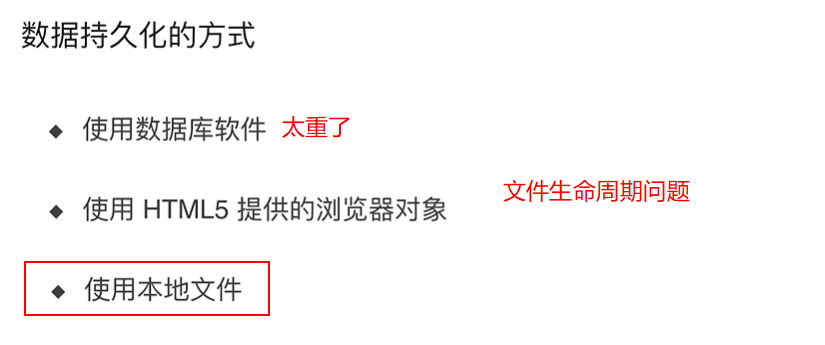

- [Electron-Store](https://github.com/sindresorhus/electron-store)
- 安装Electron-Store：`npm install electron-store`
- 基本使用：
  - 引入：`const Store = require('electron-store');`
  - `store.set(xxx,yyy)`
  - `store.get(xxx)`
  - `store.delete(xxx)`
  - `app.getPath('userData')`

```js
const Store = require('electron-store');

const store = new Store();

store.set('unicorn', '🦄');
console.log(store.get('unicorn'));
//=> '🦄'

// Use dot-notation to access nested properties
store.set('foo.bar', true);
console.log(store.get('foo'));
//=> {bar: true}

store.delete('unicorn');
console.log(store.get('unicorn'));
//=> undefined
```


### 音乐持久化数据存储类

- 安装 uuidv4：`npm install uuid --save`

新建 `musicDataStore.js` 文件

```js
const Store = require('electron-store')
const uuidv4 = require('uuid/v4')
const path = require('path')

class DataStore extends Store{
    constructor(settings) {
        super(settings)
        this.tracks = [] // 暂存音乐文件
    }

    saveTracks() {
        this.set('tracks', this.tracks)
        return this
    }

    getTracks() {
        return this.get('tracks') || []
    }

    addTracks(tracks) {
        const trackWithProps = tracks.map(track => {
            return {
                id: uuidv4(),
                path: track,
                filename: path.basename(track)
            }
        }).filter(track => { // 去重
            const currentTrackPath = this.getTracks().map(track => track.path)
            return currentTrackPath.indexOf(track.path) < 0
        })
        this.tracks = [ ...this.tracks, ...trackWithProps ]
        return this.saveTracks()

    }
}

module.exports = DataStore
```


## 播放器应用之播放器窗口

### 获取数据渲染主窗口列表之概念

### 获取数据渲染主窗口列表之编码

- 图标库：[Font Awesome](http://fontawesome.dashgame.com/)
- [bootstrap-flex](https://getbootstrap.com/docs/4.3/utilities/flex/)
- `did-finish-load` 的使用

编写 `index.js` 文件

```js
const { ipcRenderer } = require("electron")
const { $ } = require("./helper")

$("add-music-button").addEventListener("click", () => {
    ipcRenderer.send('add-music-window', 'hello')
})

const renderListHTML = (tracks) => {
    const tracksList = $('tracksList')
    const trackListHTML = tracks.reduce((html, track) => {
        html += `<li class="row music-track list-group-item d-flex justify-content-between align-items-center"> 
            <div class="col-10">
                <i class="fas fa-music mr-2"></i>
                <b>${track.fileName}</b>
            </div>
            <div class="col-2">
                <i class="fas fa-play mr-2"></i>
                <i class="fas fa-trash-alt"></i>
            </div>
        </li>`
        return html
    }, '')
    const emptyTrackHTMl = `<div class="alert alert-primary">还没有添加任何音乐</div>`
    tracksList.innerHTML = tracks.length ? `<ul class="list-group">${trackListHTML}</ul>` : emptyTrackHTMl
}

ipcRenderer.on('get-tracks', (event, tracks) => {
    console.log('index-getTracks', tracks);
    renderListHTML(tracks)
})
```

注意几个地方：

- Bootstrap 的使用

  - 使用 flex：`d-flex`
  - 外层包裹项：`list-group-item`
  - 水平和垂直居中：`justify-content-between align-items-center` 

- font-awsome 图标使用和 cdn失效问题：

  - font-awsome css 引入无效：

  ```html
  <link href="//netdna.bootstrapcdn.com/font-awesome/4.7.0/css/font-awesome.min.css" rel="stylesheet">
  ```

  - 使用 cdn 的引用

  ```html
  <link rel="stylesheet" href="https://cdnjs.cloudflare.com/ajax/libs/font-awesome/5.11.2/css/all.min.css" />
  ```
  - 图标使用：
    - 音乐：`<i class="fas fa-music mr-2"></i>` 使用了 bootstrap 右边距为2
    - 播放：`<i class="fas fa-play mr-2"></i>`
    - 垃圾桶：`<i class="fas fa-trash-alt"></i>`

- js模板插入

### 播放音乐难点分析

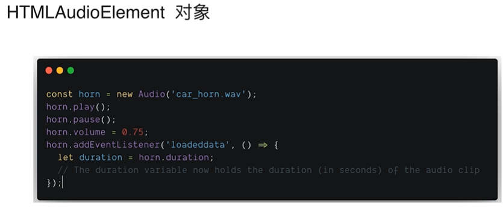

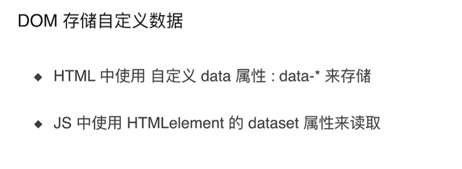

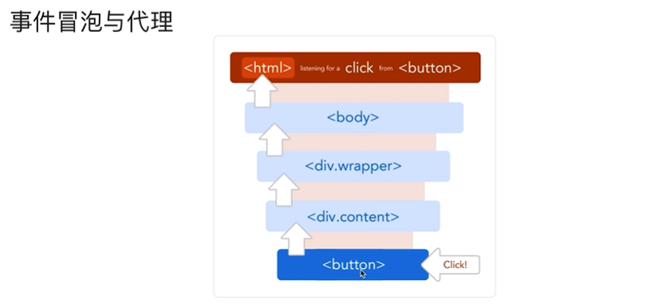


### 主窗口播放音乐

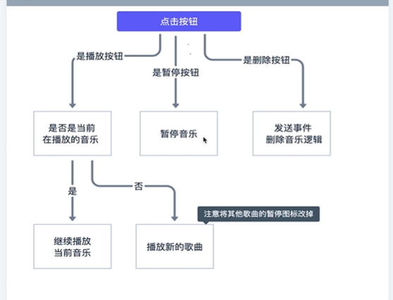


### 添加音乐播放状态

主要有几个知识点：

- 事件代理
- 自定义属性 `data`  和  其获取方式 `dataset`

编辑 `index.js` 文件

```js
const { ipcRenderer } = require("electron")
const { $ } = require("./helper")

let musicAudio = new Audio()
let allTracks
let currentTrack


$("add-music-button").addEventListener("click", () => {
    ipcRenderer.send('add-music-window', 'hello')
})

const renderListHTML = (tracks) => {
    const tracksList = $('tracksList')
    const trackListHTML = tracks.reduce((html, track) => {
        html += `<li class="row music-track list-group-item d-flex justify-content-between align-items-center"> 
            <div class="col-10">
                <i class="fas fa-music mr-2"></i>
                <b>${track.filename}</b>
            </div>
            <div class="col-2">
                <i class="fas fa-play mr-2" data-id="${track.id}"></i>
                <i class="fas fa-trash-alt" data-id="${track.id}"></i>
            </div>
        </li>`
        return html
    }, '')
    const emptyTrackHTMl = `<div class="alert alert-primary">还没有添加任何音乐</div>`
    tracksList.innerHTML = tracks.length ? `<ul class="list-group">${trackListHTML}</ul>` : emptyTrackHTMl
}

ipcRenderer.on('get-tracks', (event, tracks) => {
    console.log('index-getTracks', tracks);
    allTracks = tracks
    renderListHTML(tracks)
})

$('tracksList').addEventListener('click', function(event) {
    event.preventDefault()
    const { dataset, classList } = event.target
    const id = dataset && dataset.id

    if(id && classList.contains('fa-play')){
        if(currentTrack && currentTrack.id === id) {
            musicAudio.play()
        } else {
            currentTrack = allTracks.find(track => track.id === id)
            musicAudio.src = currentTrack.path
            musicAudio.play()
            const resetIconEle = document.querySelector(".fa-pause")
            if(resetIconEle){
                resetIconEle.classList.replace('fa-pause', 'fa-play')
            }
        }

        classList.replace('fa-play', 'fa-pause')
        
    } else if(id && classList.contains('fa-pause')) {
        musicAudio.pause()
        classList.replace('fa-pause', 'fa-play')
    }else if(id && classList.contains('fa-trash-alt')) {
        ipcRenderer.send('delete-track', id)
    }
})
```

编辑 `musicDataStore.js` 文件

```js
 deleteTrack(deleteId) {
        this.tracks = this.tracks.filter(item => item.id !== deleteId)
        return this.saveTracks()
    }
```

编辑 `main.js` 文件

```js
  ipcMain.on('delete-track', (event, id) => {
    const updateTracks = myStore.deleteTrack(id).getTracks()
    mainWindow.send('get-tracks', updateTracks)
  })
```


说明：

- 首先，歌曲最外层的 `tracksList` 添加事件代理，点击其内部的某个元素的时候，会**冒泡到这一层**。同时，拿到被点击的**元素的 dataset ，classList 等属性，获取到被点击元素的 id**
- 然后判断获取到的元素的 **播放状态** ，以及点击时的状态变更。
- 当播放一首歌然后去点击播放另一首歌的时候，需要将其他正在播放的歌曲关闭（状态为未播放）
- 当点击删除的时候，发送事件给主窗口，删除该歌曲。


### 添加音乐播放状态（下）

- help 事件计算方法：
- [bootstrap-progressbar](https://getbootstrap.com/docs/4.3/components/progress/)

编写 index.html 文件

```html
<!DOCTYPE html>
<html lang="en">
<head>
    <meta charset="UTF-8">
    <meta name="viewport" content="width=device-width, initial-scale=1.0">
    <meta http-equiv="X-UA-Compatible" content="ie=edge">
    <title>本地播放器</title>
    <link rel="stylesheet" href="../node_modules/bootstrap/dist/css/bootstrap.min.css">
    <link href="https://cdnjs.cloudflare.com/ajax/libs/font-awesome/5.11.2/css/all.min.css" rel="stylesheet">
    <link rel="stylesheet" href="./index.css">
</head>
<body>
    <div class="container mt-4">
        <h1>Hello, my player</h1>
        <button type="button" id="add-music-button" class="btn btn-primary btn-lg btn-block mt-4">添加到歌曲库</button>
        <div id="tracksList" class="mt-4"></div>
    </div>
      <!-- 以下为新增代码 -->
    <div class="container fixed-bottom bg-white pb-4">
        <hr>
        <div class="row my-2" id="player-status">
        </div>
        <div class="progress">
            <div class="progress-bar bg-success" id="player-progress" role="progressbar" style="width: 0%" >
                0%
            </div>
        </div>
    </div>
    <script>
        require("./index.js")
    </script>
</body>
</html>
```

编写 helper.js 文件

```js
exports.$ = (id) => {
   return document.getElementById(id)
}

exports.convertDuration = (time) => {
   // 计算分钟，向下取整，单位数 返回 '01'，多位数返回 '010'
   const minutes = "0" + Math.floor(time / 60)
   // 计算秒数单数返回 '02'， 多位数返回 '020'
   const seconds = "0" + Math.floor(time - minutes * 60)

   return minutes.substr(-2) + ':' + seconds.substr(-2)
}
```


编写 index.js 文件

```js
const { ipcRenderer } = require("electron")
const { $ , convertDuration } = require("./helper")

let musicAudio = new Audio()
let allTracks
let currentTrack


$("add-music-button").addEventListener("click", () => {
    ipcRenderer.send('add-music-window', 'hello')
})

const renderListHTML = (tracks) => {
    const tracksList = $('tracksList')
    const trackListHTML = tracks.reduce((html, track) => {
        html += `<li class="row music-track list-group-item d-flex justify-content-between align-items-center"> 
            <div class="col-10">
                <i class="fas fa-music mr-2"></i>
                <b>${track.filename}</b>
            </div>
            <div class="col-2">
                <i class="fas fa-play mr-2" data-id="${track.id}"></i>
                <i class="fas fa-trash-alt" data-id="${track.id}"></i>
            </div>
        </li>`
        return html
    }, '')
    const emptyTrackHTMl = `<div class="alert alert-primary">还没有添加任何音乐</div>`
    tracksList.innerHTML = tracks.length ? `<ul class="list-group">${trackListHTML}</ul>` : emptyTrackHTMl
}

ipcRenderer.on('get-tracks', (event, tracks) => {
    console.log('index-getTracks', tracks);
    allTracks = tracks
    renderListHTML(tracks)
})
// 主要为如下代码
const updateProgrssHTML = (currentTime, duration) => {
    const progress = Math.floor(currentTime / duration * 100)
    const bar = $('player-progress')
    bar.innerHTML = progress + '%'
    bar.style.width = progress + '%'
    const seeker = $('current-seeker')
    console.log(convertDuration(currentTime))
    seeker.innerHTML = convertDuration(currentTime)
}
const renderPlayerHTML = (musicName, duration) => {
    const player = $('player-status')
    const html = `<div class="col font-weight-bold"> 
                    正在播放：${musicName}
                  </div>
                  <div class="col">
                    <span id="current-seeker">00:00</span> / ${convertDuration(duration)}
                  </div>
    `
        player.innerHTML = html
}

musicAudio.addEventListener('loadedmetadata', () => {
    //渲染播放器状态
    renderPlayerHTML(currentTrack.filename, musicAudio.duration)
})

musicAudio.addEventListener('timeupdate', () => {
    //更新播放器状态
    updateProgrssHTML(musicAudio.currentTime, musicAudio.duration) // 传入音乐的当前播放时间和总时长
})

$('tracksList').addEventListener('click', function(event) {
    event.preventDefault()
    const { dataset, classList } = event.target
    const id = dataset && dataset.id

    if(id && classList.contains('fa-play')){
        if(currentTrack && currentTrack.id === id) {
            musicAudio.play()
        } else {
            currentTrack = allTracks.find(track => track.id === id)
            musicAudio.src = currentTrack.path
            musicAudio.play()
            const resetIconEle = document.querySelector(".fa-pause")
            if(resetIconEle){
                resetIconEle.classList.replace('fa-pause', 'fa-play')
            }
        }

        classList.replace('fa-play', 'fa-pause')
        
    } else if(id && classList.contains('fa-pause')) {
        musicAudio.pause()
        classList.replace('fa-pause', 'fa-play')
    }else if(id && classList.contains('fa-trash-alt')) {
        ipcRenderer.send('delete-track', id)
    }
})
```


## Electron 打包

- [Electron-builder](https://github.com/electron-userland/electron-builder)
- 安装 `npm install electron-builder --save-dev` 
- windows 平台中，上面的命令安装失败（或者是网络问题）
- 使用 yarn 安装 ` yarn add electron-builder --save-dev ` 这里会有点慢
- 在 package.json 中添加如下配置

```json
"build": {
    "appId": "com.xxx.app",
    "mac": {
      "target": ["dmg","zip"]
    },
    "win": {
      "target": ["nsis","zip"]
    }
},
"scripts": {
    "dist": "electron-builder --win --x64"
},
```

- 执行 `npm run dist` 命令，发现报错：

```js
⨯ Package "electron-builder" is only allowed in "devDependencies". Please remove it from the "dependencies" section in your package.json.  stackTrace=rror: Package "electron-builder" is only allowed in "devDependencies". Please remove it from the "dependencies" section in your package.json.
```

我们只需要将 package.json 中的 dependencies 中的 electron-builder 删除即可

再次执行 `npm run dist` 打包完成


## 参考资料

- 学习教程：[Electron开发仿网易云音乐播放器](https://coding.imooc.com/learn/list/351.html)
- [electron打包：electron-packager及electron-builder两种方式实现（for Windows）](https://blog.csdn.net/johnf_nash/article/details/100611474)

