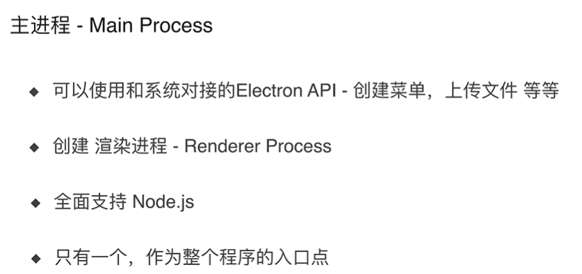
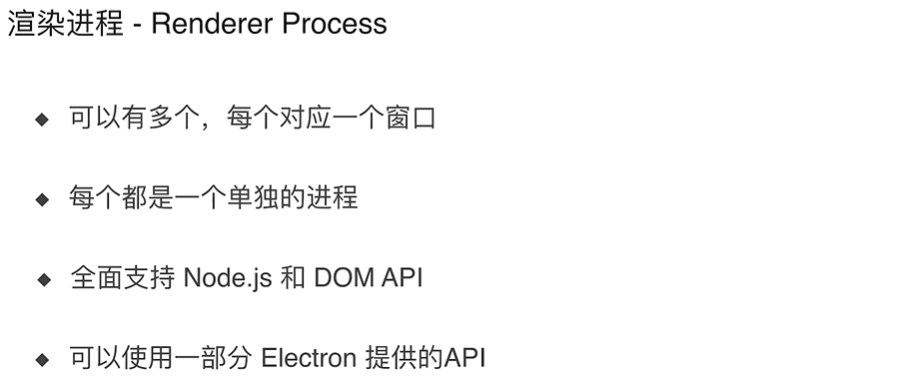

# Electron-study

> Electron 快速学习，教程参考 [Electron开发仿网易云音乐播放器](https://coding.imooc.com/class/351.html)


## 开发环境

- Node / yarn
- Git

## Electron 相关资料

- [electron-github](https://github.com/electron/electron)
- [electron-官网](https://electronjs.org) 
- [Electron在Windows下的环境搭建](https://www.cnblogs.com/wangjian8888/p/7988439.html)

## 官网-demo

```bash
# 克隆示例项目的仓库
$ git clone https://github.com/electron/electron-quick-start

# 进入这个仓库
$ cd electron-quick-start

# 安装依赖并运行
$ npm install && npm start
```

通常，在执行 `npm install` 会 **很慢或者失败**，我们使用下面的方式：

```bash
# 安装 cnpm 同时切换到 淘宝源
npm install -g cnpm --registry=https://registry.npm.taobao.org

# 安装 electron
cnpm install -g electron

# 验证 electron 是否安装成功，这里如果是使用 windows powerShell会报错，用 cmd 可以
electron -v
```


为了方便最终成果输出，建议安装 electron-packager工具，安装也很简单，建议以下面的命令全局安装：

```bash
npm install -g electron-packager
```

以上，全部都成功以后，我们再执行如下命令

```bash
# 安装依赖并运行
$ npm install && npm start
```

此时，我们就可以看到 demo 已经跑起来啦


## 第一个 Electron 应用

### 主进程和渲染进程

> 这既是 Electron 最重要的渲染知识，也是 Chromium 的渲染知识

- 主进程和渲染进程
  - 主进程



- 渲染进程




### 安装 nodemon 来监听 mainjs 的变化

执行如下命令：

```bash
npm install nodemon --save-dev
```

更改项目 `package.json` 

```js
"scripts": {
    "start": "nodemon --watch main.js --exec 'electron .'"
  },
```

### 重写 demo 代码

- 创建窗口

```js
const { app, BrowserWindow } = require('electron')

app.on('ready', () => {
  const mainWindow = new BrowserWindow({
    width: 800,
    height: 600,
    webPreferences: {
      nodeIntegration: true //设置这个可以使用 nodejs 的API
    }
  })

  mainWindow.loadFile("index.html")

})
```


- 创建子窗口

```js
const { app, BrowserWindow } = require('electron')

app.on('ready', () => {
  const mainWindow = new BrowserWindow({
    width: 800,
    height: 600,
    webPreferences: {
      nodeIntegration: true //设置这个可以使用 nodejs 的API
    }
  })

  mainWindow.loadFile("index.html")

  const secondWindow = new BrowserWindow({
    width: 600,
    height: 400,
    webPreferences: {
      nodeIntegration: true //设置这个可以使用 nodejs 的API
    },
    parent: mainWindow // 定义属性 父窗口，当父窗口关闭的时候，子窗口也会关闭
  })

  secondWindow.loadFile("second.html")
})

```

- 新建 `renderer.js` 文件，它既可以使用 nodejs 的 API，也可以使用 DOM 的 API

